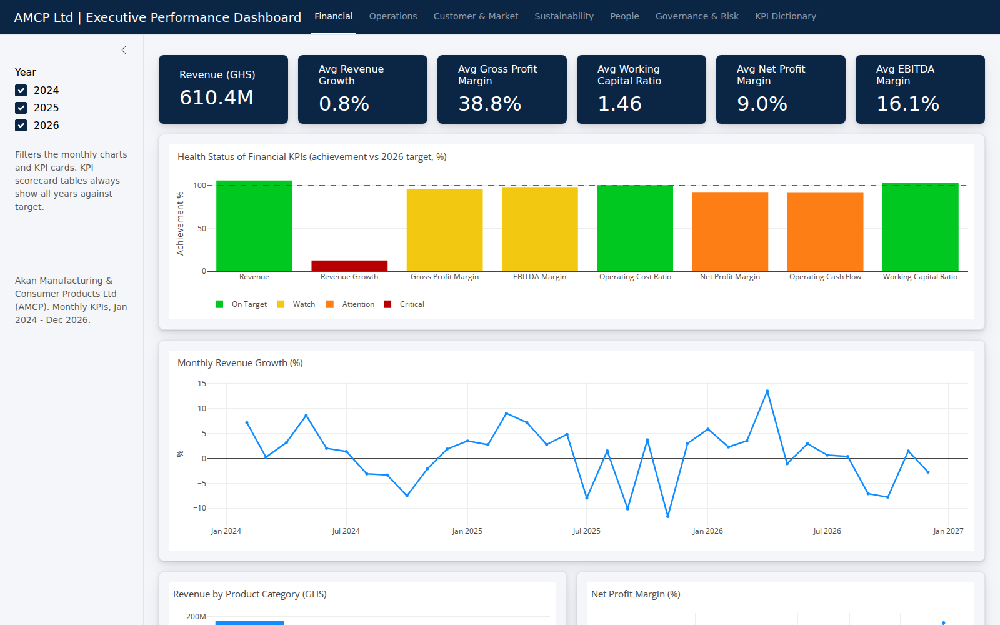

# AMCP Ltd | Executive Performance Dashboard (R Shiny)

**Live app:** https://pd33wd-david-akande.shinyapps.io/amcp-dashboard/

**Screenshot:**


An interactive R Shiny dashboard for **Akan Manufacturing & Consumer Products Ltd (AMCP)**, rebuilt from a Power BI report. It tracks 55 KPIs (54 with targets) across six strategic dimensions, Jan 2024 to Dec 2026, against 2026 targets.

## The business problem
Executives need one place to see whether the business is on track. The dashboard groups KPIs into six dimensions and flags each one as **On Target, Watch, Attention or Critical** based on achievement against target, so leadership can see where to act first.

## Pages
| Page | What it answers |
|---|---|
| Financial | Revenue, growth, margins, working capital, revenue by product category |
| Operations | Capacity, yield, defects, downtime, OEE, on-time production |
| Customer & Market | Complaints, satisfaction, retention, NPS, market share, delivery |
| Sustainability | Scope 1 and 2 emissions, energy, water, waste, training hours |
| People | Headcount, turnover, absenteeism, engagement, gender representation |
| Governance & Risk | Compliance rates, high-risk issues, privacy incidents, board attendance |
| KPI Dictionary | Definition, formula, direction and strategic objective for every KPI |

Each page has KPI cards, trend charts, a **KPI health donut** and a scorecard table. A year filter in the sidebar controls the monthly views.

## Tech
R, Shiny, bslib, plotly, dplyr, DT. Hosted on shinyapps.io.


## Project structure
```
app.R                      # UI + server
data/
  monthly_data.csv         # 36 months of monthly KPI and supporting fields
  kpi_targets.csv          # annual actuals, targets, achievement %, status
  revenue_by_product.csv   # monthly revenue by product category
  kpi_dictionary.csv       # KPI definitions
deploy.R                   # shinyapps.io deployment script
```

## Method notes
- **Status** and **Achievement %** come from the source model. For "lower is better" KPIs, achievement is target / actual.
- Differences from the original Power BI report are listed in `CHANGES.md`.
